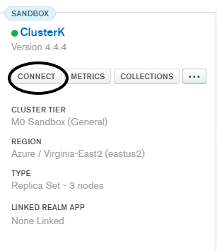

<h1 align="center">REST API</h1>

## Project Description
This project has the objective to show how API works by creating a Web App using MongoDB as database.

Content Table:
<!--ts-->
   * [Project Description](#Project-Description)
   * [Prerequisites](#Prerequisites)
   * [Requisites](#Requisites)
   * [MongoDB setup](#MongoDB-setup)
   * [Executing](#Executing)
## Features

- [x] Products Registration

## Prerequisites

For your code to run you will need to download the following tools:

- [Python](https://www.python.org/downloads/)
- [PyPI](https://pypi.org/project/pip/)
- [IDE (Recommended: PyCharm by JetBrains)](https://www.jetbrains.com/pycharm/download/)
- [Postman (Recommended)](https://www.jetbrains.com/pycharm/download/)
- [MongoDB Atlas](https://account.mongodb.com/account/register?signedOut=true)


## Requisites

Before starting, you will need to use Pip to install the libraries in order to execute the program correctly. 


```bash
> pip install -r requirements.txt
```
### MongoDB setup

Create a <em>mongoDB Atlas</em> account in order to proceed. Create a cluster with a desired name and get the URI link on the connect button.



Follow the steps using the <em>Connect your application</em> path, then copy your URI that should look like this.
```
mongodb+srv://<user>:<password>@<cluster>.lnn6e.mongodb.net/myFirstDatabase?retryWrites=true&w=majority
```

Substitute the ```app.config['MONGODB_SETTINGS'] = {"host": " <URI>}``` using your copied URI and change the <em> <user.>:<password.></em> with your credentials.

# Executing

##Python
Run your code. You should get this answer:
``` * Serving Flask app "test" (lazy loading)
 * Environment: production
   WARNING: This is a development server. Do not use it in a production deployment.
   Use a production WSGI server instead.
 * Debug mode: off
 * Running on http://127.0.0.1:5000/ (Press CTRL+C to quit)
 ```

Paste the ``http://localhost:5000/products`` on your address bar to see if the code works correctly.

##Postman
On your postman app or web browser, create a new collection to start a new query.
###POST
First you will need to set up the Headers with Json, so you can post some data. Click on the ```Headers``` option and create a new KEY:VALUE.
```
        KEY                         VALUE  
✅     Content-Type                application/json
```
Do not forget to mark the check box to make your key available. 

In the ```Body``` window, use the following example to create a new product.

```
{"name": "Car", "id": 159, "description":{"size": 555}, "price": 1500}
```
Note: The description field accepts only dictionaries as value. You can add them as much as you want.

###GET
Using the GET option on your postman app, create a new query by just simply tipping ```http://localhost:5000/products```.
You can get a list of ProductID by tipping ```http://localhost:5000/products/<productid>```
###PUT
Instead of using ```http://localhost:5000/products``` you should now use ```http://localhost:5000/products/<productid>``` to update some information about your product.
Use the same sentence of the PUT query, but without the ID field.
###DELETE
Insert ```http://localhost:5000/products/<productid>``` in the DELETE option and execute to delete the product.